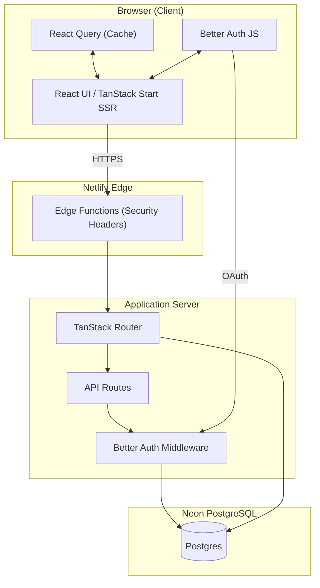
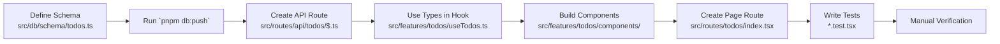

# 🚀 Solstice – Full-Stack Development Guide

Welcome to the Solstice project! This guide teaches modern full-stack web development through a real-world application while serving as a complete technical reference.

## 📚 Table of Contents

1. [What is Full-Stack Development?](#what-is-full-stack-development)
2. [Core Principles & Architecture](#core-principles--architecture)
3. [Technology Stack](#technology-stack)
4. [Project Structure Deep Dive](#project-structure-deep-dive)
5. [Key Modules Explained](#key-modules-explained)
6. [Development Workflow](#development-workflow)
7. [Contributing to the Project](#contributing-to-the-project)
8. [Practical Examples](#practical-examples)
9. [Troubleshooting & FAQ](#troubleshooting--faq)

## 🎯 What is Full-Stack Development?

Full-stack development means building both the **frontend** (what users see) and **backend** (server logic and data) of a web application. Think of it like building a restaurant:

- **Frontend**: The dining room, menu, and presentation
- **Backend**: The kitchen, recipes, and ingredient storage
- **Database**: The pantry and inventory system
- **Deployment**: The actual restaurant building and location

## 🏗️ Core Principles & Architecture

### Design Principles

| Principle                   | In Practice                                                                    |
| --------------------------- | ------------------------------------------------------------------------------ |
| **End-to-End Type Safety**  | Shared types, strict `tsconfig`, generated route & schema types                |
| **Feature-Based Structure** | All code for a feature (UI, tests, logic) lives together                       |
| **Server/Client Isolation** | `serverOnly()` wrapper and env modules prevent accidental bundle leaks         |
| **Security by Default**     | Secure cookies, CSP, rate limiting, password strength checks—all on by default |
| **Automated Confidence**    | CI runs lint, type-check, tests, build; Husky guards commits                   |

### High-Level Architecture



_Figure 1: High-level architecture showing request flow from browser to database._

Let's understand each component in the architecture:

**Browser Layer:**

- **React UI**: Your application's interface, server-side rendered by TanStack Start for fast initial loads
- **React Query**: Manages client-side state and caches server data to minimize unnecessary requests
- **Better Auth JS**: Handles authentication state and OAuth flows on the client side

**Edge Layer:**

- **Edge Functions**: Netlify runs these at the CDN edge to add security headers before content reaches users

**Application Server:**

- **TanStack Router**: File-based routing that maps your `src/routes/` files to URLs
- **API Routes**: Type-safe endpoints defined in `src/routes/api/` that handle data operations
- **Better Auth Middleware**: Protects routes and validates sessions on every request

**Database:**

- **Neon PostgreSQL**: Serverless Postgres that scales automatically and provides connection pooling

## 🛠️ Technology Stack

| Layer               | Library / Tool               | Why                                                          | Think of it as                              |
| ------------------- | ---------------------------- | ------------------------------------------------------------ | ------------------------------------------- |
| **Runtime**         | React 19, TanStack Start     | File-based routing with first-class data loaders             | The foundation and walls of your house      |
| **Auth**            | Better Auth                  | Unified email/password + OAuth with serverless support       | The security system and door locks          |
| **DB / ORM**        | Neon PostgreSQL, Drizzle ORM | Fully typed queries, migrations, pooled & direct connections | A smart warehouse that scales automatically |
| **Styling**         | Tailwind CSS 4, shadcn/ui    | Utility-first CSS + accessible React primitives              | The paint and decorations                   |
| **Build**           | Vite 7                       | Fast HMR, modern output, React compiler plugin               | The construction tools                      |
| **Testing**         | Vitest + Testing Library     | Fast jsdom tests with rich queries                           | Quality control inspectors                  |
| **CI / Deploy**     | GitHub Actions, Netlify      | Preview deploys, edge functions for headers                  | The land and utilities for your restaurant  |
| **Package Manager** | pnpm                         | Workspaces, deterministic lock-file                          | The supply chain manager                    |

## 📁 Project Structure Deep Dive

### Repository Layout

```
solstice/
├── src/                    # All source code lives here
│   ├── routes/            # File-based pages & API endpoints
│   │   ├── index.tsx      # Home page (/)
│   │   ├── (auth)/        # Auth pages group
│   │   ├── dashboard/     # Protected pages
│   │   └── api/           # API routes
│   │
│   ├── features/          # Self-contained vertical slices
│   │   └── auth/          # Authentication feature
│   │       ├── components/
│   │       └── __tests__/
│   │
│   ├── components/        # Generic building blocks
│   │   ├── auth/          # Auth-specific components
│   │   └── form-fields/   # Form building blocks
│   │
│   ├── shared/            # Cross-cutting concerns
│   │   ├── ui/            # Base UI components
│   │   ├── hooks/         # React hooks
│   │   └── lib/           # Utility functions
│   │
│   ├── lib/               # Infrastructure modules
│   │   ├── auth/          # Auth setup & middleware
│   │   ├── server/        # Server-only code
│   │   ├── security/      # Security utilities
│   │   ├── env.*.ts       # Environment validation
│   │   └── form.ts        # Form configuration
│   │
│   ├── db/                # Database layer
│   │   ├── schema/        # Table definitions
│   │   └── connections.ts # Connection helpers
│   │
│   └── tests/             # Global test setup
│       └── mocks/         # Mock data for tests
│
├── public/                # Static files (images, fonts)
├── netlify/              # Edge functions (security headers)
├── docs/                 # Additional design documents
└── scripts/              # One-off maintenance utilities
```

> **Tip:** Each directory has its own `index.ts` barrel export to keep import paths short (`@/lib`, `@/shared/ui`, etc).

### Configuration Files

| File                 | Purpose                            | When You'll Use It                  |
| -------------------- | ---------------------------------- | ----------------------------------- |
| `package.json`       | Lists all dependencies and scripts | Adding packages, running commands   |
| `pnpm-lock.yaml`     | Locks exact dependency versions    | Ensures everyone has same packages  |
| `tsconfig.json`      | TypeScript configuration           | Adjusting type checking rules       |
| `vite.config.ts`     | Build tool configuration           | Adding plugins, build optimizations |
| `vitest.config.ts`   | Test runner configuration          | Setting up test environment         |
| `drizzle.config.ts`  | Database migration config          | Managing database schema changes    |
| `netlify.toml`       | Netlify deployment settings        | Configuring deployments             |
| `docker-compose.yml` | Local PostgreSQL setup             | Running database locally            |

## 🔧 Key Modules Explained

### Environment Management (`src/lib/env.*.ts`)

- Two Zod-backed schemas: one for server (`env.server.ts`), one for client (`env.client.ts`)
- Validation happens **before** anything else runs; unsafe access crashes fast
- All env vars are typed and validated

### Database Layer (`src/db`)

- **Schema**: All tables live in `schema/` files using Drizzle's fluent API
- **Connections**: `connections.ts` exposes:
  - `pooledDb()` for serverless handlers
  - `unpooledDb()` for migrations/scripts
  - `getDb()` which auto-selects based on environment

### Authentication (`src/lib/auth`)

- **Server side**: Lazy-initialized Better Auth instance with Drizzle adapter
- **Client side**: Small facade that lazy-loads the Better Auth React client

### Routing

- Page routes live in `src/routes/`
- Use `createFileRoute` (client) or `createAPIFileRoute` (API)
- `routeTree.gen.ts` is auto-generated—**never edit by hand**
- Use `beforeLoad` for server-side protection

### Forms (`src/lib/form.ts`)

- Single `useAppForm` hook wraps TanStack Form
- Registers common field components (`ValidatedInput`, etc.)
- Always supply typed `defaultValues`; generics are inferred

### Building a Complete Feature: Todo List



_Figure 2: End-to-end flow for adding a new feature with type safety preserved across layers._

## 💻 Development Workflow

### Setup

1. **Install prerequisites**: Node 20+, pnpm, Docker
2. `pnpm install`
3. Copy `.env.example` → `.env` and fill values
4. `docker-compose up -d` (local Postgres)
5. `pnpm db:push` (creates tables)
6. `pnpm dev` – Starts development server

### Common Commands

| Task                 | Command                | Description                   |
| -------------------- | ---------------------- | ----------------------------- |
| **Start dev server** | `pnpm dev`             | Runs app locally on port 3000 |
| **Run tests**        | `pnpm test`            | Executes all test suites      |
| **Type check**       | `pnpm check-types`     | Verifies TypeScript types     |
| **Lint code**        | `pnpm lint`            | Checks code style             |
| **Build app**        | `pnpm build`           | Creates production build      |
| **Start database**   | `docker-compose up -d` | Runs PostgreSQL locally       |
| **Push schema**      | `pnpm db:push`         | Updates database schema       |

### TypeScript Practices

| Rule                 | Example                                               |
| -------------------- | ----------------------------------------------------- |
| Prefer inference     | `const user = await db.select()` – no manual generics |
| `any` is banned      | `tsconfig` sets `strict` and `noImplicitAny`          |
| Narrow errors        | Use custom error shapes in handlers                   |
| Keep helpers generic | `cn()` utility accepts any `ClassValue` union         |

## 🤝 Contributing to the Project

### Workflow

1. **Branch** from `main`: `git checkout -b feat/short-description`
2. **Implement** following existing patterns:
   - New feature → new folder under `src/features/`
   - Reusable piece → `src/components/` or `src/shared/`
3. **Add/update tests** alongside the code (`*.test.tsx`)
4. **Run local checks**: lint, types, tests, build
5. **Commit** (atomic, descriptive). Husky will block on errors
6. **Push & PR**. GitHub Actions runs CI; Netlify posts preview URL

### Review Checklist

- [ ] Tests pass (`pnpm test`)
- [ ] No TypeScript errors (`pnpm check-types`)
- [ ] No linting errors (`pnpm lint`)
- [ ] Code follows existing patterns
- [ ] Documentation updated if behavior changed

## 🛠️ Practical Examples

### Adding a New Feature (Todo List)

Here's how to implement a complete feature from database to UI:

**Step 1: Database Schema**

```typescript
// src/db/schema/todos.ts
import { pgTable, text, boolean, timestamp } from "drizzle-orm/pg-core";
import { createInsertSchema, createSelectSchema } from "drizzle-zod";

export const todos = pgTable("todos", {
  id: text("id")
    .primaryKey()
    .$defaultFn(() => crypto.randomUUID()),
  userId: text("user_id").notNull(),
  title: text("title").notNull(),
  completed: boolean("completed").default(false),
  createdAt: timestamp("created_at").defaultNow(),
});

// Auto-generate Zod schemas for validation
export const insertTodoSchema = createInsertSchema(todos);
export const selectTodoSchema = createSelectSchema(todos);
export type Todo = typeof todos.$inferSelect;
export type NewTodo = typeof todos.$inferInsert;
```

**Step 2: Push Schema to Database**

```bash
pnpm db:push  # Creates the table in your database
```

**Step 3: API Route**

```typescript
// src/routes/api/todos/$.ts
import { createAPIFileRoute } from "@tanstack/start/api";
import { z } from "zod";
import { getDb } from "@/db/connections";
import { todos, insertTodoSchema } from "@/db/schema/todos";
import { requireAuth } from "@/lib/auth/middleware/auth-guard";
import { eq } from "drizzle-orm";

export const APIRoute = createAPIFileRoute("/api/todos")({
  GET: async ({ request }) => {
    const user = await requireAuth(request);
    const db = getDb();
    const userTodos = await db.select().from(todos).where(eq(todos.userId, user.id));
    return Response.json(userTodos);
  },

  POST: async ({ request }) => {
    const user = await requireAuth(request);
    const body = await request.json();
    const validated = insertTodoSchema.parse({
      ...body,
      userId: user.id,
    });

    const db = getDb();
    const [newTodo] = await db.insert(todos).values(validated).returning();
    return Response.json(newTodo);
  },
});
```

**Step 4: Frontend Hook**

```typescript
// src/features/todos/hooks/useTodos.ts
import { useQuery, useMutation, useQueryClient } from "@tanstack/react-query";
import type { Todo, NewTodo } from "@/db/schema/todos";

export function useTodos() {
  const queryClient = useQueryClient();

  const todosQuery = useQuery({
    queryKey: ["todos"],
    queryFn: async () => {
      const res = await fetch("/api/todos");
      if (!res.ok) throw new Error("Failed to fetch todos");
      return res.json() as Promise<Todo[]>;
    },
  });

  const createTodo = useMutation({
    mutationFn: async (newTodo: Omit<NewTodo, "userId">) => {
      const res = await fetch("/api/todos", {
        method: "POST",
        headers: { "Content-Type": "application/json" },
        body: JSON.stringify(newTodo),
      });
      if (!res.ok) throw new Error("Failed to create todo");
      return res.json();
    },
    onSuccess: () => {
      queryClient.invalidateQueries({ queryKey: ["todos"] });
    },
  });

  return {
    todos: todosQuery.data ?? [],
    isLoading: todosQuery.isLoading,
    error: todosQuery.error,
    createTodo: createTodo.mutate,
  };
}
```

**Step 5: Page Component**

```typescript
// src/routes/todos/index.tsx
import { createFileRoute } from '@tanstack/react-router'
import { useTodos } from '@/features/todos/hooks/useTodos'
import { TodoList } from '@/features/todos/components/TodoList'
import { AddTodoForm } from '@/features/todos/components/AddTodoForm'

export const Route = createFileRoute('/todos')({
  component: TodosPage,
})

function TodosPage() {
  const { todos, isLoading, error, createTodo } = useTodos();

  if (isLoading) return <div>Loading...</div>;
  if (error) return <div>Error: {error.message}</div>;

  return (
    <div className="container mx-auto p-4">
      <h1 className="text-2xl font-bold mb-4">My Todos</h1>
      <AddTodoForm onSubmit={createTodo} />
      <TodoList todos={todos} />
    </div>
  );
}
```

Notice how TypeScript types flow automatically from the database schema through the API to the frontend - no manual type definitions needed!

## 🐛 Troubleshooting & FAQ

### Common Issues

| Problem                        | Symptoms                   | Solution                                                                                      |
| ------------------------------ | -------------------------- | --------------------------------------------------------------------------------------------- |
| **Database Connection Failed** | "Connection refused" error | 1. Check DATABASE_URL in .env<br>2. Ensure Docker is running<br>3. Run `docker-compose up -d` |
| **Type Errors**                | Red squiggles in VS Code   | 1. Run `pnpm install`<br>2. Restart TypeScript server<br>3. Check imports                     |
| **Auth Not Working**           | Can't login/signup         | 1. Check auth secrets in .env<br>2. Clear cookies<br>3. Check network tab                     |
| **Build Fails**                | Netlify deploy errors      | 1. Check build logs<br>2. Ensure all env vars set<br>3. Test locally first                    |

### Quick Answers

| Question                                    | Answer                                                                                 |
| ------------------------------------------- | -------------------------------------------------------------------------------------- |
| **Where is the global React Query client?** | Created in `src/router.tsx`, injected via TanStack Router context                      |
| **Can I import server code on the client?** | No. Anything importing `env.server` or `serverOnly()` will fail. Keep boundaries clear |
| **How do I add a Netlify edge function?**   | Drop a `*.ts` file in `netlify/edge-functions/`, export `default` handler              |
| **Which test env is used?**                 | Vitest jsdom. Global stubs are set in `tests/setup.ts`                                 |
| **How do I debug failing tests?**           | Use `pnpm test:watch` and add `console.log` or `screen.debug()`                        |

### Security Best Practices

1. **Never Trust User Input**: Always validate with Zod
2. **Use Environment Variables**: Never hardcode secrets
3. **Implement Proper Authentication**: Use Better Auth's built-in features
4. **Database Security**: Drizzle handles parameterized queries automatically

## 🚀 You're Ready!

You now understand:

- ✅ How modern full-stack apps are built
- ✅ The role of each technology in our stack
- ✅ Where to find and modify code
- ✅ How to contribute effectively

_Solstice follows the mantra "simple, typed, secure by default."_  
_If you keep those three goals in mind, your contributions will fit right in._

Happy coding! 🎉
