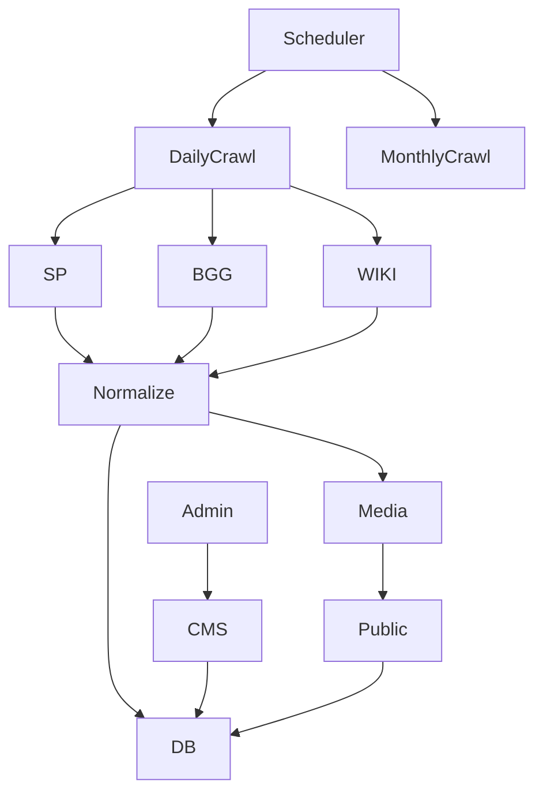

# Game Systems Rebuild Plan

Status: Approved policy bundle = Enriched

Objective

- Provide players with rich game system landing pages (hero, gallery, description, min max players, mechanics, genres, publisher, release date, reviews, FAQs).
- Build compliant crawlers to ingest and refresh data from StartPlaying, BGG, and Wikipedia.
- Preserve CMS authority with approvals and versioning. Host images in Cloudinary with licensing metadata and moderation.

Scope

- v1 sources: StartPlaying primary, BGG and Wikipedia for cross check and enrichment.
- Daily diff crawl and monthly full recrawl via Netlify schedules.
- Public browse and detail pages. Admin curation UI and recrawl controls.

Architecture overview

Policy bundle

- Compliance first: honor robots.txt, identify with UA, polite crawl, exponential backoff.
- Canonical taxonomy owned by platform with mapping tables to StartPlaying and BGG.
- Images hosted in Cloudinary with license and moderation flags, no hotlinking by default.
- Strict CMS override protection: crawlers write to scraped fields only and never overwrite CMS or moderated content.
- Schedules: daily diff refresh, monthly full recrawl.

Phase 0 - Foundations and constraints
Deliverables

- Environment variables configured locally and in Netlify with placeholders documented.
- Crawler identification policy including User Agent string and contact URL.
- Skeleton feature folder at `src/features/game-systems/` with subfolders for crawlers,
  services, schemas and UI.
- Draft spec for crawl event logging fields and severity levels.
  Checklist
- [x] Confirm env secrets available in development and Netlify:
      `CLOUDINARY_CLOUD_NAME`, `CLOUDINARY_API_KEY`, `CLOUDINARY_API_SECRET`.
- [x] Define crawler User Agent string and contact URL
      (e.g., `SolsticeGameCrawler/1.0 (+https://solstice.example/contact)`).
- [x] Create feature folder structure for game systems
      (schemas, queries, mutations, types, crawler).
- [x] Agree on error logging fields for crawl events
      (systemSlug, source, status, startedAt, finishedAt, httpStatus, errorMessage).
      Definition of done
- [x] `.env.example` lists Cloudinary keys and Netlify env vars populated.
- [x] Crawler config exports UA string and contact URL.
- [x] Empty feature folder committed with README describing structure.
- [x] Logging spec reviewed and accepted by engineering and content teams.

Phase 1 - Migrations and data model
Deliverables

- Extended game_systems schema, publishers, media_assets, faqs, external tag maps, crawl events, indexes.
- Updated Drizzle schema files and relations.
  Checklist
- [x] Alter game_systems: add slug not null indexed, description_scraped, description_cms, release_date, publisher_id, publisher_url, hero_image_id, source_of_truth, external_refs jsonb, crawl_status, last_crawled_at, last_success_at, error_message, is_published, cms_version, cms_approved, last_approved_at, last_approved_by.
- [x] Create publishers table with name unique, website_url, wikipedia_url, bgg_publisher_id, verified, notes.
- [x] Create media_assets with fields for Cloudinary public_id, secure_url, dims, format, license, license_url, kind, order_index, moderated, checksum.
- [x] Create faqs table linked to game_systems with source and is_cms_override.
- [x] Create external_category_map and external_mechanic_map with unique source tag constraints and confidence.
- [x] Create system_crawl_events to store crawl runs and stats.
- [x] Add indexes and unique constraints per design.
- [x] Update Drizzle schema files and relations.
- [ ] Generate and run SQL migrations locally, push to dev DB.
      Definition of done
- [ ] pnpm db commands succeed and new tables appear.
- [x] TypeScript types compile with no errors (pnpm check-types).
- [ ] ERD updated in docs.

Phase 2 - Cloudinary media pipeline
Deliverables

- Cloudinary storage service, env config, transformations, moderation flags.
  Checklist
- [x] Add env keys and document secure handling.
- [x] Implement Cloudinary service upload delete helpers and typed metadata.
- [x] Implement transformation presets for hero and thumb variants.
- [x] Implement checksum to dedupe uploads.
- [x] Write unit tests with mocked Cloudinary.
      Definition of done
- [x] Uploads succeed in dev and URLs stored in media_assets.
- [x] Moderation flag respected in queries.
- [x] Moderation flag reflected in UI.

Phase 3 - Feature module baseline
Deliverables

- Schemas, queries, mutations files with Zod validation and serverOnly imports.
  Checklist
- [x] Create Zod input and output schemas for listSystems, getSystemBySlug, upsertCMSContent, reorderImages, mapExternalTag, triggerRecrawl.
- [x] Implement queries for listing with filters and detail fetch with hero, gallery, tags, FAQs, review aggregate placeholders.
- [x] Implement upsertCmsContent mutation.
- [x] Implement reorderImages mutation.
- [x] Implement mapExternalTag mutation.
- [x] Implement triggerRecrawl mutation.
- [x] Unit tests for schema validation.
- [x] Unit tests for happy path queries.
      Definition of done
- [x] pnpm test passes with coverage added for feature module.

Phase 4 - StartPlaying connector
Deliverables

- Compliant crawler built with [Apify's Crawlee library](https://crawlee.dev/llms.txt) for normalization and image ingestion.
  Checklist
- [x] Implement robots.txt fetch and cache; refuse if disallowed.
- [x] Implement rate limiting via Pacer with jitter and retries with backoff.
- [x] Implement index page scraper to collect system links.
- [x] Implement detail scraper to parse description, min max players, tags, images, publisher link.
- [x] Normalize fields to canonical schema; update external_refs.
- [x] Map tags via external maps; record unmapped with counts.
- [x] Ingest images through Cloudinary with metadata and moderation default false unless license allows.
- [x] Record system_crawl_events and update crawl_status on game_systems.
- [x] Unit tests for parsers and mappers with fixtures.
      Definition of done
- [ ] Daily diff run updates changed systems
- [x] CMS fields remain untouched during diff run
- [ ] No policy violations in logs; failure cases captured in events.

Phase 5 - BGG connector
Deliverables

- XML API v2 lookup and enrichment.
  Checklist
- [x] Implement search by name and reconcile to single bggThingId with heuristics.
- [x] Fetch year published, publishers, categories mechanics where available.
- [x] Update external_refs and taxonomy mapping tables.
- [x] Cross check without overwriting CMS protected fields.
- [x] Tests for ID resolution and enrichment merge.
      Definition of done
- [ ] At least 70 percent of popular systems receive cross checked fields.

Phase 6 - Wikipedia connector
Deliverables

- MediaWiki extract and infobox parsing.
  Checklist
- [ ] Resolve page title; fetch extract for description_scraped.
- [ ] Parse infobox for release_date and publisher; validate plausibility.
- [ ] Update external_refs wikipediaTitle.
- [ ] Tests for parsing and merge precedence.
      Definition of done
- [ ] Conflicts produce crawl events with partial status and admin visibility.

Phase 7 - Scheduling and jobs
Deliverables

- Netlify scheduled functions and manual recrawl.
  Checklist
- [ ] Create daily diff function file and monthly full function file.
- [ ] Configure netlify.toml schedules for daily and monthly crons.
- [ ] Implement manual recrawl mutation restricted to admins.
- [ ] Smoke test jobs with dry run mode.
      Definition of done
- [ ] Schedules visible in Netlify and logs confirm execution.

Phase 8 - Public UI
Deliverables

- /systems browse and /system slug detail pages.
  Checklist
- [ ] Create systems browse route with filters for mechanics, genres, players, publisher, year and search.
- [ ] Create system detail route with hero, chips, details, description, gallery, FAQs, reviews aggregate.
- [ ] Add loading and empty states and fallbacks when moderated images unavailable.
- [ ] Accessibility pass on images alt text and keyboard navigation.
      Definition of done
- [ ] Lighthouse performance and accessibility 90 plus in dev.

Phase 9 - Admin UI
Deliverables

- Systems dashboard pages for curation.
  Checklist
- [ ] Create dashboard list with completeness and crawl status, filters for needs curation and errors.
- [ ] Create system editor with tabs for Overview, Content, Media, Taxonomy, Crawl.
- [ ] Implement image moderation toggles and hero selection.
- [ ] Implement external tag mapping UI with search and assignment to canonical items.
- [ ] Implement recrawl button with source selection and status feedback.
      Definition of done
- [ ] Content manager can publish a system end to end without developer intervention.

Phase 10 - Reviews aggregation
Deliverables

- Display system level rating and sample reviews by aggregating gm_reviews joined via games.
  Checklist
- [ ] Query aggregate rating and histogram for a system id.
- [ ] Fetch latest N comments and display with attribution respecting privacy.
- [ ] Add error and empty state handling.
      Definition of done
- [ ] Aggregates render within 200 ms at p95 on dev data.

Phase 11 - Observability and notifications
Deliverables

- Crawl history UI, structured logs, optional Slack email hook.
  Checklist
- [ ] Persist detailed stats in system_crawl_events.
- [ ] Add admin crawl history view with filters and pagination.
- [ ] Implement optional webhook to alert on failures partial statuses and large diffs.
      Definition of done
- [ ] Operators can diagnose crawl outcomes in under five minutes from UI.

Phase 12 - Testing strategy
Checklist

- [ ] Unit tests for tag mapping, schema validation, connectors parsers, Cloudinary service.
- [ ] Integration test for end to end ingestion of a fixture system updating DB and media.
- [ ] E2E smoke for public browse and detail routes and admin edit flow.
- [ ] CI gates for pnpm lint, pnpm check types, pnpm test with coverage threshold.

Phase 13 - Documentation and runbooks
Checklist

- [ ] Update database ERD and docs with new tables and relations.
- [ ] Write crawler operations playbook with cadence and rollback steps.
- [ ] Document taxonomy governance and mapping workflow.
- [ ] Document media licensing handling and moderation policy.

Data contracts summary
listSystems request

- filters mechanicsIds number[], genreIds number[], playersMin number, playersMax number, publisherIds number[], releasedFrom date, releasedTo date, q string, page number, perPage number
  listSystems response
- items array of SystemCard, page number, perPage number, total number
  SystemCard
- id number, slug string, name string, heroUrl string nullable, minPlayers number, maxPlayers number, yearReleased number nullable, mechanics array of string, genres array of string
  getSystemBySlug response
- system with fields and relations hero media gallery media tags arrays faqs array reviews aggregate

Crawler rate limits and timeouts

- Global RPS target 0.3 to 0.5 per source with random jitter 100 to 400 ms.
- Connect timeout 8 s, read timeout 15 s, max retries 3 with backoff 1 s, 2 s, 4 s plus jitter.

Merge precedence

- CMS fields override all sources.
- If CMS empty prefer StartPlaying then BGG then Wikipedia.
- Publisher reference prefers BGG then Wikipedia then StartPlaying unless CMS set.

Security and compliance

- Respect robots and terms, store source and license metadata for each media asset.
- Sanitize and escape HTML inputs and render as rich text safely.
- PII free ingestion; only public data collected.

Rollout plan

- [ ] Deploy migrations and feature baseline to staging.
- [ ] Run limited crawl on top 20 systems and review outputs.
- [ ] Enable public pages behind feature flag.
- [ ] Expand crawler scope and remove flag after content QA.

Owner and checkpoints

- Engineering owner TBD, Content owner TBD.
- Weekly checkpoint reviewing unmapped tags count, crawl errors, and coverage.

Appendices

- Env vars: CLOUDINARY_CLOUD_NAME, CLOUDINARY_API_KEY, CLOUDINARY_API_SECRET.
- Optional webhooks: SLACK_WEBHOOK_URL for alerts.
