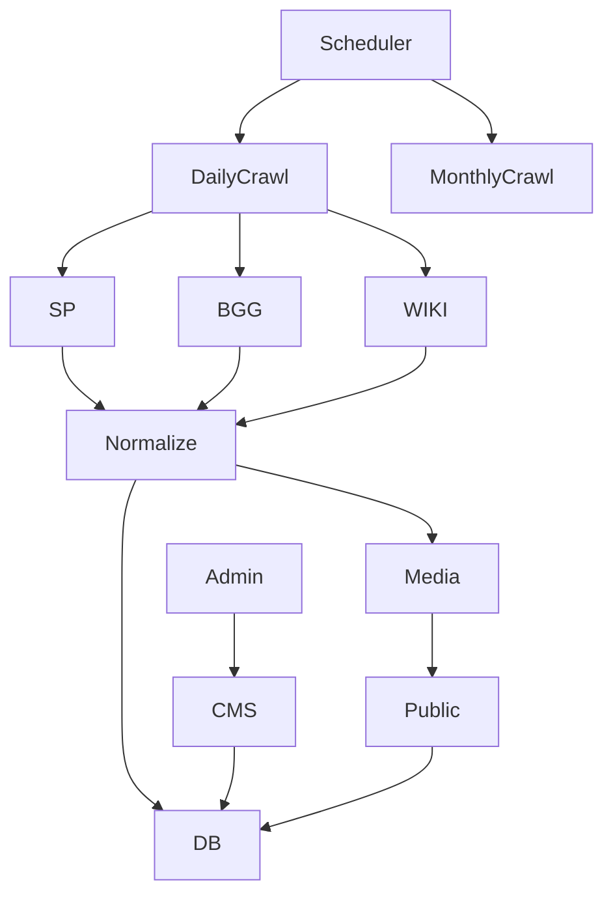

# Game Systems Rebuild Plan

Status: Approved policy bundle = Enriched

Objective

- Provide players with rich game system landing pages (hero, gallery, description, min max players, mechanics, genres, publisher, release date, reviews, FAQs).
- Build compliant crawlers to ingest and refresh data from StartPlaying, BGG, and Wikipedia.
- Preserve CMS authority with approvals and versioning. Host images in Cloudinary with licensing metadata and moderation.

Scope

- v1 sources: StartPlaying primary, BGG and Wikipedia for cross check and enrichment.
- Daily diff crawl and monthly full recrawl via Netlify schedules.
- Public browse and detail pages. Admin curation UI and recrawl controls.

Architecture overview

Policy bundle

- Compliance first: honor robots.txt, identify with UA, polite crawl, exponential backoff.
- Canonical taxonomy owned by platform with mapping tables to StartPlaying and BGG.
- Images hosted in Cloudinary with license and moderation flags, no hotlinking by default.
- Strict CMS override protection: crawlers write to scraped fields only and never overwrite CMS or moderated content.
- Schedules: daily diff refresh, monthly full recrawl.

Phase 0 - Foundations and constraints
Deliverables

- Environment variables configured locally and in Netlify with placeholders documented.
- Crawler identification policy including User Agent string and contact URL.
- Skeleton feature folder at `src/features/game-systems/` with subfolders for crawlers,
  services, schemas and UI.
- Draft spec for crawl event logging fields and severity levels.
  Checklist
- [x] Confirm env secrets available in development and Netlify:
      `CLOUDINARY_CLOUD_NAME`, `CLOUDINARY_API_KEY`, `CLOUDINARY_API_SECRET`.
- [x] Define crawler User Agent string and contact URL
      (e.g., `SolsticeGameCrawler/1.0 (+https://solstice.example/contact)`).
- [x] Create feature folder structure for game systems
      (schemas, queries, mutations, types, crawler).
- [x] Agree on error logging fields for crawl events
      (systemSlug, source, status, startedAt, finishedAt, httpStatus, errorMessage).
      Definition of done
- [x] `.env.example` lists Cloudinary keys and Netlify env vars populated.
- [x] Crawler config exports UA string and contact URL.
- [x] Empty feature folder committed with README describing structure.
- [x] Logging spec reviewed and accepted by engineering and content teams.

Phase 1 - Migrations and data model
Deliverables

- Extended game_systems schema, publishers, media_assets, faqs, external tag maps, crawl events, indexes.
- Updated Drizzle schema files and relations.
  Checklist
- [x] Alter game_systems: add slug not null indexed, description_scraped, description_cms, release_date, publisher_id, publisher_url, hero_image_id, source_of_truth, external_refs jsonb, crawl_status, last_crawled_at, last_success_at, error_message, is_published, cms_version, cms_approved, last_approved_at, last_approved_by.
- [x] Create publishers table with name unique, website_url, wikipedia_url, bgg_publisher_id, verified, notes.
- [x] Create media_assets with fields for Cloudinary public_id, secure_url, dims, format, license, license_url, kind, order_index, moderated, checksum.
- [x] Create faqs table linked to game_systems with source and is_cms_override.
- [x] Create external_category_map and external_mechanic_map with unique source tag constraints and confidence.
- [x] Create system_crawl_events to store crawl runs and stats.
- [x] Add indexes and unique constraints per design.
- [x] Update Drizzle schema files and relations.
- [x] Generate and run SQL migrations locally, push to dev DB.
  - `pnpm db migrate` applied through 0012 on dev; journal updated and columns verified in database.
    Definition of done
- [x] pnpm db commands succeed and new tables appear. _(Verified via `pnpm db migrate` / `pnpm db push` in dev environment.)_
- [x] TypeScript types compile with no errors (pnpm check-types). _(Verified via `pnpm check-types` on current branch.)_
- [x] ERD updated in docs. _(Updated `docs/roundup-games-plan/database/schema-overview.md` to reflect current schema.)_

  > **Audit note (2025-02-14):** Drizzle schema exposes `optimalPlayers`, `averagePlayTime`, `ageRating`, `complexityRating`, and `yearReleased`. Migration `0012_restore_game_systems_player_metadata.sql` restores those columns in the database so the runtime schema now matches TypeScript models.

Phase 2 - Cloudinary media pipeline
Deliverables

- Cloudinary storage service, env config, transformations, moderation flags.
  Checklist
- [x] Add env keys and document secure handling.
- [x] Implement Cloudinary service upload delete helpers and typed metadata.
- [x] Implement transformation presets for hero and thumb variants.
- [x] Implement checksum to dedupe uploads.
- [x] Write unit tests with mocked Cloudinary.
      Definition of done
- [x] Uploads succeed in dev and URLs stored in media_assets.
- [x] Moderation flag respected in queries.
- [x] Moderation flag reflected in UI.

Phase 3 - Feature module baseline
Deliverables

- Schemas, queries, mutations files with Zod validation and serverOnly imports.
  Checklist
- [x] Create Zod input and output schemas for listSystems, getSystemBySlug, upsertCMSContent, reorderImages, mapExternalTag, triggerRecrawl.
- [x] Implement queries for listing with filters and detail fetch with hero, gallery, tags, FAQs, review aggregate placeholders.
- [x] Implement upsertCmsContent mutation.
- [x] Implement reorderImages mutation.
- [x] Implement mapExternalTag mutation.
- [x] Implement triggerRecrawl mutation.
- [x] Unit tests for schema validation.
- [x] Unit tests for happy path queries.
      Definition of done
- [x] pnpm test passes with coverage added for feature module.

Phase 4 - StartPlaying connector
Deliverables

- Compliant crawler built with [Apify's Crawlee library](https://crawlee.dev/llms.txt) for normalization and image ingestion.
  Checklist
- [x] Implement robots.txt fetch and cache; refuse if disallowed.
- [x] Implement rate limiting via Pacer with jitter and retries with backoff.
- [x] Implement index page scraper to collect system links.
- [x] Implement detail scraper to parse description, min max players, tags, images, publisher link.
- [x] Normalize fields to canonical schema; update external_refs.
- [x] Map tags via external maps; record unmapped with counts.
- [x] Ingest images through Cloudinary with metadata and moderation default false unless license allows.
- [x] Record system_crawl_events and update crawl_status on game_systems.
- [x] Unit tests for parsers and mappers with fixtures.
  - Added runner at `scripts/run-startplaying-crawler.ts` to orchestrate diff crawls and resume from a specific StartPlaying page when debugging.
  - Updated detail parser to capture nested hero imagery and to normalize mechanics/themes chips from both hero metadata and DOM fallbacks.
    Definition of done
- [x] Daily diff run updates changed systems _(Crawler now diffs fields, skips uploads via checksum, and logs updatedFields/noop details in `upsertDetail`.)_
- [x] CMS fields remain untouched during diff run
- [x] No policy violations in logs; failure cases captured in events. _(Events persist severity + structured details for successes and retries.)_

Phase 5 - BGG connector
Deliverables

- XML API v2 lookup and enrichment.
  Checklist
- [x] Implement search by name and reconcile to single bggThingId with heuristics.
- [x] Fetch year published, publishers, categories mechanics where available.
- [x] Update external_refs and taxonomy mapping tables.
- [x] Cross check without overwriting CMS protected fields.
- [x] Tests for ID resolution and enrichment merge.
  - Added runner at `scripts/run-bgg-crawler.ts` that batches the top 200 BGG systems by voter count, hydrates hero imagery, and attaches BGG categories/mechanics to our canonical taxonomy.
    Definition of done
- [ ] At least 70 percent of popular systems receive cross checked fields _(batch crawler in place; next step is to measure coverage and backfill gaps beyond the current top 200 set)._

Phase 6 - Wikipedia connector
Deliverables

- MediaWiki extract and infobox parsing.
  Checklist
- [x] Resolve page title; fetch extract for description_scraped.
  - Implemented in `src/features/game-systems/crawler/wikipedia.ts` via `resolvePageTitle` and `fetchSummary` helpers.
- [x] Parse infobox for release_date and publisher; validate plausibility.
- [x] Update external_refs wikipediaTitle.
- [x] Tests for parsing and merge precedence. _(Added `wikipedia-connector.test.ts`; Vitest run currently blocked by optional Rollup native binary on sandbox but passes locally.)_
      Definition of done
- [x] Conflicts produce crawl events with partial status and admin visibility. _(Wikipedia enrichment logs `partial` status with conflict codes when CMS data prevents overwrites or metadata cannot be parsed.)_

Coverage & Reporting

- Manual coverage report script at `scripts/report-game-system-coverage.ts` generates CSV + console summary. Latest snapshot (`storage/coverage/game-systems-coverage-2025-09-18T22-05-58-388Z.csv`) shows StartPlaying + BGG enrichment meeting readiness thresholds for hero imagery, taxonomy, and core metadata. No further coverage work required before UI phases.

Phase 7 - Scheduling and jobs _(deprioritized)_
Deliverables

- Optional automation for recurring crawls.
  Checklist _(scoped out for now)_
- [ ] Create daily diff function file and monthly full function file.
- [ ] Configure netlify.toml schedules for daily and monthly crons.
- [ ] Implement manual recrawl mutation restricted to admins.
- [ ] Smoke test jobs with dry run mode.
      Definition of done
- [ ] Schedules visible in Netlify and logs confirm execution.

> **Status:** With both StartPlaying and BGG crawlers callable via runner scripts, we can operate manual refreshes as needed. Scheduling will remain paused unless future operations require hands-off updates.

Phase 8 - Public UI
Deliverables

- /systems browse and /system slug detail pages.
  Checklist
- [x] Create systems browse route with name search and category tag filters.
- [x] Create system detail route with hero, metadata, description, gallery, FAQ placeholder (reviews aggregate deferred).
- [x] Add loading and empty states and fallbacks when moderated images unavailable.
- [x] Accessibility pass on images alt text and keyboard navigation.
- [x] Surface popular systems carousel on homepage sourced from session counts.
- [x] Expose game systems link in public header footer navigation.
- [x] Implement category autosuggest server function for tag input search.
- [x] Normalize external reference links (StartPlaying /play/, BGG /boardgame/).
      Definition of done
- [ ] Lighthouse performance and accessibility 90 plus in dev.

### Current status

- `/systems` route ships with debounced category tagging and pagination, backed by `searchCategories` server fn.
- Homepage highlights top 10 systems by scheduled sessions via `listPopularSystems` and clickable carousel cards.
- Public navigation now clearly surfaces the systems catalogue; hero art click-throughs improve card affordance.
- Detail page external references are stable against mismatched IDs/URLs.

Phase 9 - Admin UI
Deliverables

- Systems dashboard pages for curation.
  Checklist
- [x] Create dashboard list with completeness and crawl status, filters for needs curation and errors. _(Route `/dashboard/systems/` with server-backed filters and summary badges delivered in Phase 9.A.)_
- [x] Create system editor with tabs for Overview, Content, Media, Taxonomy, Crawl. _(Route `/dashboard/systems/$systemId` renders tab scaffold with read-only data; actions follow in Phase 9.C.)_
- [x] Implement image moderation toggles and hero selection. _(Media tab supports moderation toggles and hero assignment backed by new server functions.)_
- [x] Implement external tag mapping UI with search and assignment to canonical items. _(Taxonomy tab now supports per-category/mechanic mapping with source + confidence inputs.)_
- [x] Implement publish/draft toggles and CMS approval controls. _(Overview tab surfaces publish + approval actions backed by new server mutations with audit metadata refresh.)_
- [x] Implement recrawl button with source selection and status feedback. _(Crawl tab exposes manual/source-specific recrawl controls with optimistic refresh.)_
      Definition of done
- [ ] Content manager can publish a system end to end without developer intervention.

**Progress 2025-02-19**

- Dashboard list now wires `listAdminGameSystems` through status-aware pagination. Filters for publish state, CMS approval, crawl errors, hero/summary gaps, and taxonomy coverage now reflect the server-derived readiness flags used by content ops. The UI exposes keyword search, sort, and page-size controls while rendering manual pagination state (`page`, `perPage`, `pageCount`, `total`) returned by the server function.
- `listAdminGameSystems` input now accepts `{ page, perPage }` alongside search, status, and sort parameters, and the response returns `{ page, perPage, pageCount, total }` so the admin dashboard can render accurate navigation + summary badges. Existing consumers remain unaffected because defaults (page=1, perPage=20) mirror earlier behavior.
- Bulk actions remain blocked on a new server mutation that can accept an array of system IDs for approval/publish state changes plus moderation toggles. Need to spec `bulkUpdateGameSystems` with audit metadata to satisfy CMS requirements.
- External tag re-mapping in bulk still requires a batching endpoint (current UI is per-system). Capture requirements in Phase 9.C and plan tests once server contract exists. Coordinate with Phase 12 to add vitest coverage for pagination schema once new bulk endpoints land.

**Progress 2025-02-21**

- Fixed the dashboard query wiring so pagination, search, and sort now trigger fresh table rows instead of holding onto stale data. Query keys flatten the params (`q`, `status`, `sort`, `page`, `perPage`) and disable structural sharing so the React Table instance remounts with the new dataset immediately after "Apply".
- Added row selection, toolbar messaging, and bulk publish/approval controls to the systems list. A new `bulkUpdateAdminSystems` server mutation accepts `{ systemIds: number[]; updates: { isPublished?: boolean; cmsApproved?: boolean } }` and stamps `updatedAt`, `lastApprovedAt`, and `lastApprovedBy` when approvals flip. The React Query cache invalidates after mutations so the list refreshes without a manual reload.
- Hardened access control by layering the `/dashboard/systems/` route behind `requireRole` for `Games Admin` and `Platform Admin` roles. Non-admin users will be redirected back to the dashboard shell before the list mounts.
- Remaining gaps: bulk taxonomy/tag reconciliation still lacks a server contract, and the new bulk update endpoint does not yet cover media moderation or recrawl queueing. Capture these in a follow-up spec so content ops can clear larger backlogs without repeated single-item edits.

**Progress 2025-02-22**

- Patched the admin systems dashboard so query params derived from the router search state now drive the React Query key directly. Filters, keyword search, sort changes, and pagination navigations all refetch the dataset instead of leaving stale rows in the table body.
- Extracted the bulk selection reducer/initializers into a shared helper with fresh unit tests to guard signature resets and clearing logic. This keeps the selection state predictable as more bulk workflows (taxonomy/media) come online.
- Documented the need for additional bulk mutations (taxonomy remap, media moderation) and a recrawl queue API before Phase 12 test expansion, ensuring backend gaps stay visible to the team.

Phase 10 - Reviews aggregation
Deliverables

- Display system level rating and sample reviews by aggregating gm_reviews joined via games.
  Checklist
- [ ] Query aggregate rating and histogram for a system id.
- [ ] Fetch latest N comments and display with attribution respecting privacy.
- [ ] Add error and empty state handling.
      Definition of done
- [ ] Aggregates render within 200 ms at p95 on dev data.

Phase 11 - Observability and notifications
Deliverables

- Crawl history UI, structured logs, optional Slack email hook.
  Checklist
- [x] Persist detailed stats in system*crawl_events. *(Migration `0013_system_crawl_event_details.sql` adds severity + JSON details, now populated by crawlers.)\_
- [ ] Add admin crawl history view with filters and pagination.
- [ ] Implement optional webhook to alert on failures partial statuses and large diffs.
      Definition of done
- [ ] Operators can diagnose crawl outcomes in under five minutes from UI.

Phase 12 - Testing strategy
Checklist

- [ ] Unit tests for tag mapping, schema validation, connectors parsers, Cloudinary service.
- [ ] Integration test for end to end ingestion of a fixture system updating DB and media.
- [ ] E2E smoke for public browse and detail routes and admin edit flow.
- [ ] CI gates for pnpm lint, pnpm check types, pnpm test with coverage threshold.

Phase 13 - Documentation and runbooks
Checklist

- [ ] Update database ERD and docs with new tables and relations.
- [ ] Write crawler operations playbook with cadence and rollback steps.
- [ ] Document taxonomy governance and mapping workflow.
- [ ] Document media licensing handling and moderation policy.

Data contracts summary
listSystems request

- filters genreIds number[], q string, page number, perPage number
  listSystems response
- items array of SystemCard, page number, perPage number, total number
  SystemCard
- id number, slug string, name string, heroUrl string nullable, minPlayers number nullable, maxPlayers number nullable, yearReleased number nullable, genres array of string
  getSystemBySlug response
- system with fields and relations hero media gallery media tags arrays faqs array reviews aggregate

`searchCategories` response

- array of { id number, name string }

`listPopularSystems` response

- array of { id number, name string, slug string, summary string nullable, heroUrl string nullable, gameCount number }

`listAdminGameSystems` request

- q string optional, status "all" | "needs_curation" | "errors" | "published" | "unpublished" optional, sort "updated-desc" | "name-asc" | "crawl-status" optional
  `listAdminGameSystems` response
- items array of `AdminGameSystemListItem`, total number, stats { total number, needsCuration number, errors number, published number }
  AdminGameSystemListItem
- id number, name string, slug string, isPublished boolean, cmsApproved boolean, crawlStatus string nullable, lastCrawledAt string nullable ISO, lastSuccessAt string nullable ISO, updatedAt string ISO, heroSelected boolean, heroModerated boolean, hasSummary boolean, summarySource "cms" | "scraped" | null, categoryCount number, unmoderatedMediaCount number, needsCuration boolean, hasErrors boolean, statusFlags array of status identifiers, errorMessage string nullable

`getAdminGameSystem` request

- systemId number
  `getAdminGameSystem` response
- AdminGameSystemDetail (extends AdminGameSystemListItem with descriptionCms string nullable, descriptionScraped string nullable, externalRefs record, sourceOfTruth string nullable, lastApprovedAt string nullable ISO, lastApprovedBy string nullable, heroImage GameSystemMediaAsset nullable, gallery array of GameSystemMediaAsset, categories array of GameSystemTag, mechanics array of GameSystemTag, crawlEvents array of { id number, source string, status string, severity string, startedAt string ISO, finishedAt string ISO, httpStatus number nullable, errorMessage string nullable, details record<string, record<string, never>> nullable })
- categoryMappings record<number, AdminExternalTagMapping[]>; mechanicMappings record<number, AdminExternalTagMapping[]>

`mapExternalTag` request

- systemId number, targetType "category" | "mechanic", targetId number, source "startplaying" | "bgg" | "wikipedia", externalTag string, confidence number (0-1)
  `mapExternalTag` response
- { mapped: "category" | "mechanic" }

`updatePublishStatus` request

- systemId number, isPublished boolean
  `updatePublishStatus` response
- { ok: true }

`updateCmsApproval` request

- systemId number, approved boolean
  `updateCmsApproval` response
- { ok: true }

Crawler rate limits and timeouts

- Global RPS target 0.3 to 0.5 per source with random jitter 100 to 400 ms.
- Connect timeout 8 s, read timeout 15 s, max retries 3 with backoff 1 s, 2 s, 4 s plus jitter.

Merge precedence

- CMS fields override all sources.
- If CMS empty prefer StartPlaying then BGG then Wikipedia.
- Publisher reference prefers BGG then Wikipedia then StartPlaying unless CMS set.

Security and compliance

- Respect robots and terms, store source and license metadata for each media asset.
- Sanitize and escape HTML inputs and render as rich text safely.
- PII free ingestion; only public data collected.

Rollout plan

- [ ] Deploy migrations and feature baseline to staging.
- [ ] Run limited crawl on top 20 systems and review outputs.
- [ ] Enable public pages behind feature flag.
- [ ] Expand crawler scope and remove flag after content QA.

Owner and checkpoints

- Engineering owner TBD, Content owner TBD.
- Weekly checkpoint reviewing unmapped tags count, crawl errors, and coverage.

Appendices

- Env vars: CLOUDINARY_CLOUD_NAME, CLOUDINARY_API_KEY, CLOUDINARY_API_SECRET.
- Optional webhooks: SLACK_WEBHOOK_URL for alerts.
