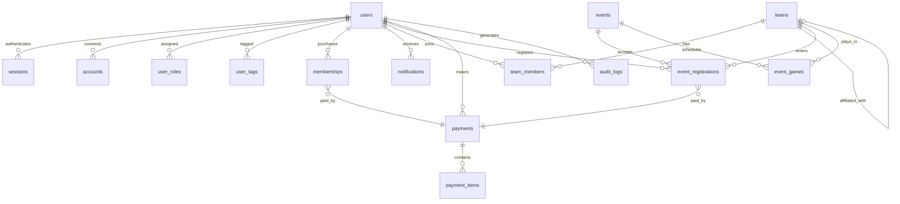

# Database Schema & Relationships

## Overview

The Quadball Canada platform uses PostgreSQL with Drizzle ORM for type-safe database operations. The schema is designed for extensibility, audit trails, and performance at scale.

## Entity Relationship Diagram



## Key Concepts

### Role-Based Access Control (RBAC)

The system implements hierarchical roles with scoped permissions:

```
global_admin         # Full system access
├── event_coordinator # Manage all events
├── team_lead        # Manage teams
├── referee          # Officiate games
└── player           # Basic member access
```

**Scoping**: Roles can be scoped to specific entities:

- `team_lead:team-uuid` - Lead for specific team
- `event_coordinator:event-uuid` - Coordinator for specific event

### Membership Lifecycle

```
User Registration → Profile Completion → Membership Purchase → Active Member
                                                ↓
                                         Team Assignment
                                                ↓
                                         Event Registration
```

### Payment Flow

```
User Selects Item → Pricing Rules Applied → Square Checkout → Webhook Confirmation
                           ↓                                         ↓
                    Discount Calculation                    Database Transaction
                                                                    ↓
                                                            Email Confirmation
```

## Core Relationships

### User → Membership

- One-to-many: Users can have multiple memberships over time
- Only one active membership per season
- Historical memberships retained for records

### User → Team

- Many-to-many through `team_members`
- Constraint: One active team membership at a time
- Supports roles: player, coach, manager, owner

### Team → Event

- Many-to-many through `event_registrations`
- Teams register as a unit for tournaments
- Individual players register for other event types

### Payment → Items

- One-to-many: Single payment can cover multiple items
- Examples: Membership + event fee in one transaction
- Line items preserve pricing at time of purchase

## Schema Design Principles

### 1. Extensibility via JSONB

Strategic use of JSONB fields for flexibility:

```typescript
// User privacy settings
privacySettings: {
  showEmail: boolean;
  showPhone: boolean;
  showBirthYear: boolean;
}

// Event custom fields
customFields: {
  dietaryRestrictions?: string;
  accommodationNeeds?: string;
  teamPreference?: string;
}
```

### 2. Audit Trail

Every financial transaction and sensitive operation is logged:

```typescript
// Payment metadata
metadata: {
  ip_address: string;
  user_agent: string;
  square_receipt_url: string;
  refund_reason?: string;
}

// Audit log entry
{
  action: "MEMBERSHIP_PURCHASED",
  userId: "uuid",
  entityType: "membership",
  entityId: "uuid",
  changes: { /* before/after */ }
}
```

### 3. Soft Deletes

Critical data is never hard deleted:

```typescript
// Status fields instead of deletion
status: 'active' | 'inactive' | 'cancelled' | 'expired'

// Temporal data
deactivatedAt?: Date;
deactivatedBy?: string;
```

### 4. Optimistic Concurrency

Version fields prevent race conditions:

```typescript
// Version tracking
version: number; // Incremented on update
updatedAt: Date; // Last modification time
```

## Performance Considerations

### Indexes

Critical indexes for common queries:

```sql
-- User lookups
users(email) -- Login
users(id, created_at) -- Sorted lists

-- Team queries
team_members(team_id, status) -- Active roster
team_members(user_id) WHERE status = 'active' -- User's team

-- Event queries
events(slug) -- URL lookups
events(start_date, status) -- Upcoming events
event_registrations(event_id, status) -- Participant lists

-- Payment queries
payments(user_id, created_at) -- User history
payments(provider_payment_id) -- Webhook lookups
```

### Query Patterns

Common access patterns optimized:

1. **User Dashboard**: Single query with all active relationships
2. **Team Roster**: Eager load members with user details
3. **Event Registration**: Check capacity with COUNT before INSERT
4. **Payment History**: Paginated with items included

## Data Integrity

### Constraints

Database-enforced business rules:

```sql
-- One active team per user
UNIQUE (user_id) WHERE status = 'active' ON team_members

-- Unique slugs
UNIQUE (slug) ON teams
UNIQUE (slug) ON events

-- Valid price ranges
CHECK (price_cents >= 0) ON membership_types
CHECK (fee_cents >= 0) ON events
```

### Transactions

Critical operations wrapped in transactions:

1. **Payment Processing**: Payment record + membership/registration + audit log
2. **Team Transfer**: Remove from old team + add to new team + notifications
3. **Event Cancellation**: Update event + refund payments + notify participants

## Migration Strategy

### Drizzle Migrations

All schema changes managed through Drizzle:

```typescript
// Generate migration
pnpm db:generate

// Apply migration
pnpm db:push

// Migration naming convention
0001_initial_schema.sql
0002_add_team_affiliations.sql
0003_add_payment_items.sql
```

### Zero-Downtime Migrations

1. **Add nullable columns** first
2. **Backfill data** in batches
3. **Add constraints** after backfill
4. **Remove old columns** in next release

## Security Considerations

### Sensitive Data

Fields requiring special handling:

- `users.phone` - Encrypted at rest
- `users.emergencyContact` - Encrypted JSONB
- `payments.metadata` - Contains PII
- `audit_logs.ipAddress` - Privacy regulations

### Access Control

Row-level security patterns:

```typescript
// Users see own data
function canViewUser(userId: string, targetId: string) {
  return userId === targetId || hasRole(userId, "global_admin");
}

// Team members see team data
function canViewTeam(userId: string, teamId: string) {
  return isTeamMember(userId, teamId) || hasRole(userId, "team_lead");
}
```

## Future Considerations

### Partitioning

As data grows, consider partitioning:

- `audit_logs` by month
- `notifications` by created_at
- `payments` by year

### Read Replicas

For analytics and reporting:

- Dedicated replica for admin dashboards
- Async replication with minimal lag
- Query routing in application layer

The schema is designed to evolve with the platform while maintaining data integrity and performance.
