# Database Schema Overview

## Entity Relationship Diagram

```mermaid
erDiagram
    users {
        id uuid PK
        email string UK
        emailVerified boolean
        name string
        image string
        createdAt timestamp
        updatedAt timestamp
        pronouns string
        namePronunciation string
        birthDate date
        gender string
        phone string
        emergencyContact jsonb
        privacySettings jsonb
        demographics jsonb
    }

    sessions {
        id string PK
        userId uuid FK
        expiresAt timestamp
        token string
        userAgent string
    }

    accounts {
        id string PK
        userId uuid FK
        providerId string
        providerUserId string
        accessToken string
        refreshToken string
    }

    user_roles {
        id uuid PK
        userId uuid FK
        role string
        grantedBy uuid FK
        grantedAt timestamp
        scope string
        expiresAt timestamp
    }

    user_tags {
        id uuid PK
        userId uuid FK
        tag string
        value string
        appliedBy uuid FK
        appliedAt timestamp
    }

    membership_types {
        id uuid PK
        name string
        description string
        priceCents integer
        validFromDate date
        validToDate date
        active boolean
        benefits jsonb
        createdAt timestamp
    }

    memberships {
        id uuid PK
        userId uuid FK
        membershipTypeId uuid FK
        status string
        purchaseDate timestamp
        expiresAt timestamp
        paidAmountCents integer
        paymentId string
        createdAt timestamp
        updatedAt timestamp
    }

    teams {
        id uuid PK
        name string
        slug string UK
        description string
        logo string
        primaryColor string
        secondaryColor string
        foundedYear integer
        location string
        isActive boolean
        maxRosterSize integer
        associatedTeamId uuid FK
        associationType string
        createdAt timestamp
        updatedAt timestamp
        createdBy uuid FK
    }

    team_members {
        id uuid PK
        teamId uuid FK
        userId uuid FK
        role string
        jerseyNumber integer
        position string
        joinedAt timestamp
        status string
        notes string
    }

    events {
        id uuid PK
        name string
        slug string UK
        description string
        eventType string
        location string
        locationDetails jsonb
        startDate timestamp
        endDate timestamp
        registrationOpenDate timestamp
        registrationCloseDate timestamp
        maxParticipants integer
        feeCents integer
        customFields jsonb
        status string
        createdAt timestamp
        updatedAt timestamp
        createdBy uuid FK
    }

    event_registrations {
        id uuid PK
        eventId uuid FK
        userId uuid FK
        teamId uuid FK
        registrationData jsonb
        status string
        feePaidCents integer
        paymentId string
        registeredAt timestamp
        updatedAt timestamp
    }

    event_games {
        id uuid PK
        eventId uuid FK
        name string
        gameType string
        scheduledAt timestamp
        location string
        homeTeamId uuid FK
        awayTeamId uuid FK
        homeScore integer
        awayScore integer
        status string
        metadata jsonb
        createdAt timestamp
        updatedAt timestamp
    }

    event_officials {
        id uuid PK
        eventId uuid FK
        userId uuid FK
        role string
        gameIds uuid[]
        notes string
        paymentCents integer
        createdAt timestamp
    }

    payments {
        id uuid PK
        userId uuid FK
        amount integer
        currency string
        status string
        paymentMethod string
        providerId string
        providerPaymentId string
        metadata jsonb
        createdAt timestamp
        updatedAt timestamp
    }

    payment_items {
        id uuid PK
        paymentId uuid FK
        itemType string
        itemId uuid
        description string
        quantity integer
        unitPriceCents integer
        totalPriceCents integer
    }

    notifications {
        id uuid PK
        userId uuid FK
        type string
        title string
        message string
        data jsonb
        readAt timestamp
        createdAt timestamp
        expiresAt timestamp
    }

    audit_logs {
        id uuid PK
        userId uuid FK
        action string
        entityType string
        entityId uuid
        changes jsonb
        ipAddress string
        userAgent string
        createdAt timestamp
    }

    %% Relationships
    users ||--o{ sessions : "has"
    users ||--o{ accounts : "has"
    users ||--o{ user_roles : "has"
    users ||--o{ user_tags : "has"
    users ||--o{ memberships : "has"
    users ||--o{ team_members : "joins"
    users ||--o{ event_registrations : "registers"
    users ||--o{ payments : "makes"
    users ||--o{ notifications : "receives"
    users ||--o{ audit_logs : "generates"
    users ||--o{ teams : "creates"
    users ||--o{ events : "creates"
    users ||--o{ event_officials : "officiates"

    membership_types ||--o{ memberships : "defines"

    teams ||--o{ team_members : "contains"
    teams ||--o{ event_registrations : "registers"
    teams ||--o{ event_games : "plays_home"
    teams ||--o{ event_games : "plays_away"
    teams ||--o{ teams : "associated_with"

    events ||--o{ event_registrations : "receives"
    events ||--o{ event_games : "contains"
    events ||--o{ event_officials : "staffs"

    payments ||--o{ payment_items : "contains"
```



## Core Design Principles

### 1. Extensibility

- **JSON Fields**: Custom data without schema changes
- **Soft Enums**: String constants for future flexibility
- **Metadata Fields**: Store provider-specific data

### 2. Audit Trail

- **Created/Updated Timestamps**: All entities track lifecycle
- **Audit Logs Table**: Sensitive operations logged
- **Immutable Records**: Financial data never deleted

### 3. Soft Deletes

- **Status Fields**: Mark entities as inactive vs hard delete
- **Cascade Handling**: Related entities marked inactive together

### 4. Multi-Tenancy Ready

- **Scoped Permissions**: Role system supports organization-level access
- **Isolated Data**: Foreign keys ensure proper data boundaries

## Key Tables Detail

### User Management

#### `users` (extends Better Auth)

```sql
-- Core profile information
name VARCHAR(255) NOT NULL,
pronouns VARCHAR(50),
name_pronunciation VARCHAR(255),
birth_date DATE,
gender VARCHAR(50),
phone VARCHAR(50),

-- Emergency contact (JSON)
emergency_contact JSONB, -- {name, phone, relationship}

-- Privacy controls
privacy_settings JSONB, -- {showEmail, showPhone, showBirthYear}

-- Demographics (optional, for reporting)
demographics JSONB -- {ethnicity, languages, accessibility}
```

#### `user_roles` (RBAC implementation)

```sql
-- Hierarchical roles
role VARCHAR(50) NOT NULL, -- 'global_admin', 'event_coordinator', etc.

-- Permission scope
scope VARCHAR(100), -- 'global', 'team:uuid', 'event:uuid'

-- Temporal permissions
granted_at TIMESTAMP DEFAULT NOW(),
expires_at TIMESTAMP, -- NULL = permanent

-- Audit trail
granted_by UUID REFERENCES users(id)
```

#### `user_tags` (flexible categorization)

```sql
-- Tag system for features/pricing
tag VARCHAR(50) NOT NULL, -- 'early_bird', 'veteran', 'student'
value VARCHAR(255), -- Optional tag value

-- Applied metadata
applied_by UUID REFERENCES users(id),
applied_at TIMESTAMP DEFAULT NOW()
```

### Membership System

#### `membership_types` (product catalog)

```sql
-- Product details
name VARCHAR(255) NOT NULL, -- '2025-2026 Player Membership'
description TEXT,
price_cents INTEGER NOT NULL,

-- Validity period
valid_from_date DATE NOT NULL,
valid_to_date DATE NOT NULL,

-- Benefits/features
benefits JSONB, -- {events: [], discounts: []}

-- Status
active BOOLEAN DEFAULT true
```

#### `memberships` (user purchases)

```sql
-- Purchase details
status VARCHAR(50) NOT NULL, -- 'active', 'expired', 'cancelled'
purchase_date TIMESTAMP DEFAULT NOW(),
expires_at TIMESTAMP NOT NULL,

-- Payment info
paid_amount_cents INTEGER NOT NULL,
payment_id VARCHAR(255) REFERENCES payments(id)
```

### Team Management

#### `teams` (organization units)

```sql
-- Basic info
name VARCHAR(255) NOT NULL,
slug VARCHAR(255) UNIQUE NOT NULL,
description TEXT,

-- Branding
logo VARCHAR(255), -- URL to logo image
primary_color VARCHAR(7), -- Hex color
secondary_color VARCHAR(7),

-- Metadata
founded_year INTEGER,
location VARCHAR(255),
max_roster_size INTEGER DEFAULT 20,

-- Status
is_active BOOLEAN DEFAULT true
```

#### `team_members` (roster management)

```sql
-- Member details
role VARCHAR(50) NOT NULL, -- 'player', 'coach', 'manager'
jersey_number INTEGER,
position VARCHAR(50), -- 'chaser', 'beater', 'keeper', 'seeker'

-- Status tracking
joined_at TIMESTAMP DEFAULT NOW(),
status VARCHAR(50) DEFAULT 'active', -- 'active', 'inactive', 'traded'

-- Notes
notes TEXT -- Coach notes, injury status, etc.

-- Constraint: Users can only be on one active team at a time
UNIQUE INDEX idx_one_team_per_user ON team_members(user_id) WHERE status = 'active'
```

### Event System

#### `events` (competitions/tournaments)

```sql
-- Event details
name VARCHAR(255) NOT NULL,
slug VARCHAR(255) UNIQUE NOT NULL,
description TEXT,
event_type VARCHAR(50) NOT NULL, -- 'tournament', 'league', 'scrimmage'

-- Location
location VARCHAR(255),
location_details JSONB, -- {address, coordinates, parking}

-- Scheduling
start_date TIMESTAMP NOT NULL,
end_date TIMESTAMP NOT NULL,
registration_open_date TIMESTAMP,
registration_close_date TIMESTAMP,

-- Capacity & pricing
max_participants INTEGER,
fee_cents INTEGER DEFAULT 0,

-- Custom registration fields
custom_fields JSONB, -- Form schema for additional data

-- Status
status VARCHAR(50) DEFAULT 'draft' -- 'draft', 'open', 'closed', 'cancelled'
```

#### `event_registrations` (participant tracking)

```sql
-- Registration data
registration_data JSONB, -- Answers to custom fields
status VARCHAR(50) DEFAULT 'pending', -- 'pending', 'confirmed', 'cancelled'

-- Payment tracking
fee_paid_cents INTEGER DEFAULT 0,
payment_id VARCHAR(255) REFERENCES payments(id),

-- Timestamps
registered_at TIMESTAMP DEFAULT NOW(),
updated_at TIMESTAMP DEFAULT NOW()
```

### Payment System

#### `payments` (transaction records)

```sql
-- Financial details
amount INTEGER NOT NULL, -- Amount in cents
currency VARCHAR(3) DEFAULT 'CAD',
status VARCHAR(50) NOT NULL, -- 'pending', 'completed', 'failed', 'refunded'

-- Payment method
payment_method VARCHAR(50), -- 'card', 'bank_transfer', 'cash'

-- Provider integration
provider_id VARCHAR(50) NOT NULL, -- 'square', 'stripe'
provider_payment_id VARCHAR(255), -- External reference

-- Metadata
metadata JSONB -- Provider-specific data
```

#### `payment_items` (line items)

```sql
-- Item details
item_type VARCHAR(50) NOT NULL, -- 'membership', 'event_fee', 'merchandise'
item_id UUID, -- References membership_types, events, etc.
description VARCHAR(255) NOT NULL,

-- Pricing
quantity INTEGER DEFAULT 1,
unit_price_cents INTEGER NOT NULL,
total_price_cents INTEGER NOT NULL
```

## Migration Strategy

### Phase 1: Foundation (Milestone 1)

- User roles and tags
- Basic team structure
- Membership types

### Phase 2: Core Features (Milestones 2-3)

- Full user profiles
- Team membership
- Payment processing

### Phase 3: Events (Milestone 4)

- Event creation
- Registration system
- Game scheduling

### Phase 4: Advanced Features (Milestones 5-8)

- Complex pricing rules
- Notifications
- Analytics tables

## Performance Considerations

### Indexing Strategy

```sql
-- User lookups
CREATE INDEX idx_users_email ON users(email);
CREATE INDEX idx_users_created_at ON users(created_at);

-- Role queries
CREATE INDEX idx_user_roles_user_id ON user_roles(user_id);
CREATE INDEX idx_user_roles_role ON user_roles(role);

-- Team queries
CREATE INDEX idx_team_members_team_id ON team_members(team_id);
CREATE INDEX idx_team_members_user_id ON team_members(user_id);

-- Event queries
CREATE INDEX idx_events_slug ON events(slug);
CREATE INDEX idx_events_start_date ON events(start_date);
CREATE INDEX idx_event_registrations_event_id ON event_registrations(event_id);
CREATE INDEX idx_event_registrations_user_id ON event_registrations(user_id);

-- Payment queries
CREATE INDEX idx_payments_user_id ON payments(user_id);
CREATE INDEX idx_payments_provider_payment_id ON payments(provider_payment_id);
```

### Query Optimization

- Use `EXPLAIN ANALYZE` for slow queries
- Implement pagination for large datasets
- Consider read replicas for analytics
- Use connection pooling (pgBouncer)

## Security Considerations

### Row-Level Security (Future)

```sql
-- Example: Users can only see their own data
CREATE POLICY user_own_data ON users
  FOR ALL
  TO authenticated
  USING (id = auth.uid());

-- Example: Team members can see team data
CREATE POLICY team_member_access ON team_members
  FOR SELECT
  TO authenticated
  USING (team_id IN (
    SELECT team_id FROM team_members WHERE user_id = auth.uid()
  ));
```

### Data Encryption

- Sensitive fields encrypted at application level
- Use environment variables for encryption keys
- Rotate keys regularly

### Backup Strategy

- Daily automated backups
- Point-in-time recovery
- Cross-region replication for disaster recovery
