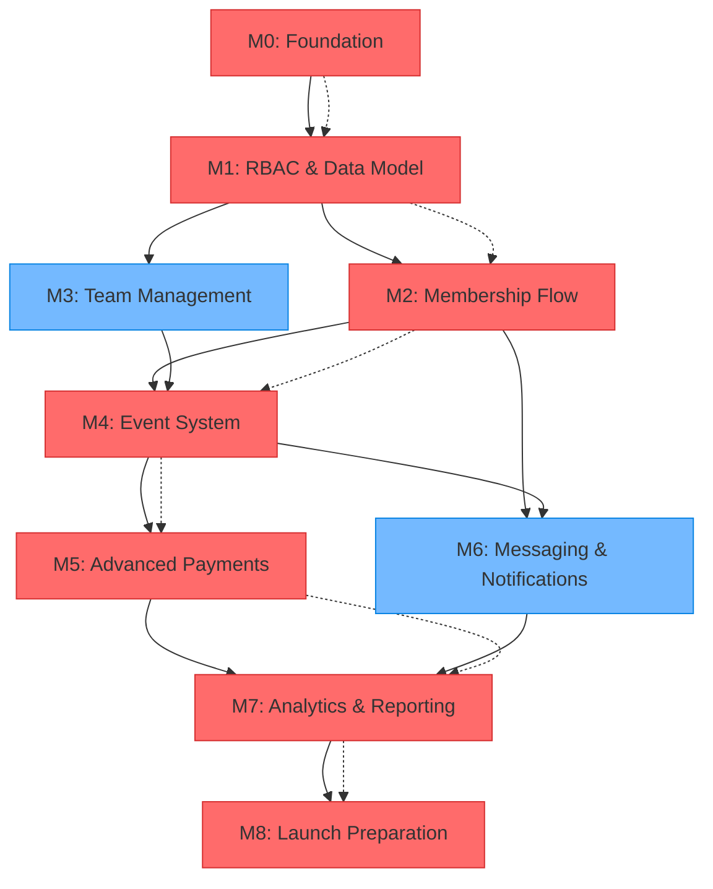

# Milestone Dependencies & Critical Path

## Dependency Graph



## Critical Path Analysis

### Primary Critical Path (19 weeks)

```
M0 → M1 → M2 → M4 → M5 → M7 → M8
1w   2w   3w   6w   3w   4w   4w = 23 weeks total
```

**Why Critical**: Each milestone in this path has dependencies that block subsequent work:

- M0: Infrastructure foundation required for all development
- M1: Data model and RBAC required for user management
- M2: Payment system required for event fees
- M4: Event system core to business model
- M5: Advanced payments needed for complex pricing
- M7: Analytics needed for business insights
- M8: Final polish required for launch

### Secondary Paths

```
M1 → M3 → M4  (9 weeks)
M2 → M6 → M7  (10 weeks)
```

These can run in parallel with the critical path but have merge points.

## Detailed Dependency Analysis

### Milestone 0: Foundation

**Dependencies**: None (starting point)
**Blocks**: All other milestones
**Critical Elements**:

- Environment setup and validation
- Base authentication system
- Deployment pipeline
- Security foundation

**Risk**: Low - mostly configuration work

### Milestone 1: RBAC & Data Model

**Dependencies**: M0 (deployment pipeline, auth foundation)
**Blocks**: M2, M3 (user management), M4 (event permissions)
**Critical Elements**:

- User roles and permissions system
- Database schema foundation
- Team and membership table structure

**Risk**: Medium - schema changes are expensive later

**Dependency Details**:

- Requires working auth system from M0
- Database migrations must be tested thoroughly
- RBAC patterns affect all future features

### Milestone 2: Membership Flow

**Dependencies**: M1 (user model, roles, membership tables)
**Blocks**: M4 (event payments), M6 (member communications)
**Critical Elements**:

- Payment processing integration
- User profile management
- Membership status tracking

**Risk**: High - payment integration complexity

**Dependency Details**:

- User roles from M1 determine access levels
- Membership tables from M1 store purchase data
- Payment webhooks affect multiple systems

### Milestone 3: Team Management

**Dependencies**: M1 (user model, team tables, RBAC)
**Blocks**: M4 (team event registration)
**Critical Elements**:

- Team creation and management
- Roster management tools
- Team-scoped permissions

**Risk**: Medium - complex permission interactions

**Dependency Details**:

- Team tables and relationships from M1
- RBAC system from M1 for team-level permissions
- User management patterns from M1

**Parallel Work Opportunity**: Can start some M3 work before M2 completion

### Milestone 4: Event System

**Dependencies**: M2 (payment system), M3 (team management), M1 (permissions)
**Blocks**: M5 (advanced pricing), M6 (event notifications), M7 (event analytics)
**Critical Elements**:

- Event creation and management
- Registration with payment integration
- Tournament bracket generation

**Risk**: High - complex business logic, multiple integrations

**Dependency Details**:

- Payment system from M2 for event fees
- Team management from M3 for team registrations
- User and permission system from M1
- Custom form system depends on solid data model

### Milestone 5: Advanced Payments

**Dependencies**: M4 (event payment integration), M2 (basic payment system)
**Blocks**: M7 (financial reporting)
**Critical Elements**:

- Flexible pricing rules
- Bulk payment processing
- Financial reporting foundation

**Risk**: Medium - builds on M2/M4 payment work

**Dependency Details**:

- Basic payment infrastructure from M2
- Event payment patterns from M4
- Team payment scenarios from M3

### Milestone 6: Messaging & Notifications

**Dependencies**: M2 (user management), M4 (event system)
**Blocks**: M7 (communication analytics)
**Critical Elements**:

- Email service integration
- Notification system
- Automated communication workflows

**Risk**: Low - mostly independent functionality

**Dependency Details**:

- User data and preferences from M2
- Event data for automated reminders from M4
- Team data for group communications from M3

**Parallel Work Opportunity**: Can work independently once M2 is complete

### Milestone 7: Analytics & Reporting

**Dependencies**: M5 (financial data), M6 (communication data), M4 (event data)
**Blocks**: M8 (performance optimization)
**Critical Elements**:

- Data aggregation and reporting
- Dashboard framework
- Business intelligence tools

**Risk**: Medium - depends on data quality from all previous milestones

**Dependency Details**:

- Financial data from M5 for revenue reporting
- Communication metrics from M6
- Event and registration data from M4
- User and membership data from M2

### Milestone 8: Launch Preparation

**Dependencies**: M7 (core platform complete)
**Blocks**: None (final milestone)
**Critical Elements**:

- Performance optimization
- Security hardening
- Final integrations and polish

**Risk**: Medium - integration and performance issues

## Risk Mitigation Strategies

### Critical Path Risks

#### 1. M1 Database Schema Issues

**Risk**: Schema changes require complex migrations
**Mitigation**:

- Design schema carefully upfront
- Use database branching for testing
- Plan migration scripts early
  **Contingency**: Simplify schema, add complexity later

#### 2. M2 Payment Integration Delays

**Risk**: Square API complexity, webhook reliability
**Mitigation**:

- Start Square integration immediately after M1
- Implement comprehensive testing environment
- Have Stripe integration as backup
  **Contingency**: Manual payment processing for initial launch

#### 3. M4 Event System Complexity

**Risk**: Custom forms, dynamic pricing, bracket generation
**Mitigation**:

- Break into smaller deliverables
- Use proven libraries where possible
- Implement MVP first, enhance later
  **Contingency**: Launch with basic event registration

### Dependency Optimization

#### Parallel Development Opportunities

**During M1 (Week 2-3)**:

- Start M2 UI wireframes
- Begin Square API research
- Plan M3 database relationships

**During M2 (Week 4-6)**:

- Start M3 team management UI
- Begin M6 email service setup
- Plan M4 event schema

**During M4 (Week 11-16)**:

- Begin M6 notification system
- Start M5 pricing rules design
- Plan M7 analytics data model

#### Fast-Track Options

**If Ahead of Schedule**:

1. Merge M5 into M4 (combine payment features)
2. Start M7 analytics earlier using M4 data
3. Begin M8 optimization during M7

**If Behind Schedule**:

1. Defer M5 advanced features to post-launch
2. Simplify M6 to basic email only
3. Reduce M7 to essential metrics only

## Cross-Milestone Interfaces

### Data Flow Dependencies

```
M1 (Schema) → M2 (Users) → M4 (Events) → M7 (Analytics)
    ↓             ↓            ↓
   M3 (Teams) → M4 (Team Reg) → M5 (Bulk Pay) → M7
    ↓             ↓            ↓
   M6 (Team Msg) → M6 (Event Msg) → M7
```

### API Dependencies

| Consuming Milestone | Provider Milestone | Interface                                 |
| ------------------- | ------------------ | ----------------------------------------- |
| M2                  | M1                 | User roles, membership types              |
| M3                  | M1                 | User model, team permissions              |
| M4                  | M2                 | Payment processing, user profiles         |
| M4                  | M3                 | Team management, roster access            |
| M5                  | M2,M4              | Payment systems, pricing data             |
| M6                  | M2,M3,M4           | User data, team data, event data          |
| M7                  | M2,M4,M5,M6        | All business data                         |
| M8                  | M7                 | Performance metrics, optimization targets |

### Shared Components

| Component           | First Used | Also Used By   | Critical?       |
| ------------------- | ---------- | -------------- | --------------- |
| Payment System      | M2         | M4, M5         | ✅ Critical     |
| User Management     | M1         | M2, M3, M4, M6 | ✅ Critical     |
| Notification System | M6         | M2, M4, M5     | ❌ Nice-to-have |
| Email Templates     | M2         | M4, M6         | ✅ Critical     |
| Data Export         | M7         | M3, M4, M5     | ❌ Nice-to-have |

## Milestone Integration Points

### M1 → M2 Integration

**What**: User management system with payment capability
**Key Interfaces**:

- User profile API
- Role checking middleware
- Membership status tracking

**Integration Tasks** (1 week):

- Connect payment system to user accounts
- Implement membership status updates
- Test role-based access to payment features

### M2 + M3 → M4 Integration

**What**: Combined user and team management for events
**Key Interfaces**:

- Team payment aggregation
- Member eligibility checking
- Roster-based registration

**Integration Tasks** (1 week):

- Team-based event registration flow
- Payment splitting for team registrations
- Member verification against team rosters

### M4 + M5 Integration

**What**: Enhanced payment system for events
**Key Interfaces**:

- Dynamic pricing engine
- Bulk payment processing
- Financial reporting data

**Integration Tasks** (0.5 weeks):

- Pricing rules applied to event fees
- Team payment workflows
- Enhanced payment reporting

### M2,M3,M4 → M6 Integration

**What**: Communication system across all user types
**Key Interfaces**:

- User notification preferences
- Team communication channels
- Event-based messaging

**Integration Tasks** (1 week):

- Notification preference management
- Team and event message targeting
- Automated communication workflows

### All → M7 Integration

**What**: Analytics across all business functions
**Key Interfaces**:

- Data aggregation from all systems
- Report generation APIs
- Dashboard integration

**Integration Tasks** (1.5 weeks):

- Data pipeline setup
- Report template creation
- Dashboard performance optimization

## Schedule Optimization

### Earliest Possible Completion

With perfect execution and parallel work:

- **Optimistic**: 20 weeks (saving 3 weeks through parallelization)
- **Realistic**: 23 weeks (original estimate)
- **Pessimistic**: 27 weeks (allowing for integration challenges)

### Buffer Time Allocation

- **M1**: +0.5 weeks (schema changes)
- **M2**: +1 week (payment integration complexity)
- **M4**: +1.5 weeks (event system complexity)
- **M7**: +0.5 weeks (data integration challenges)
- **M8**: +0.5 weeks (performance optimization)

**Total Buffer**: 4 weeks (built into 30-week timeline)

### Fast-Track Scenarios

**Scenario 1**: Skip M5 initially

- Save 3 weeks
- Launch with basic pricing only
- Add advanced features post-launch

**Scenario 2**: Simplify M6

- Save 1.5 weeks
- Basic email only, no advanced notifications
- Add features incrementally

**Scenario 3**: Minimal M7

- Save 2 weeks
- Essential metrics only
- Build advanced analytics post-launch
