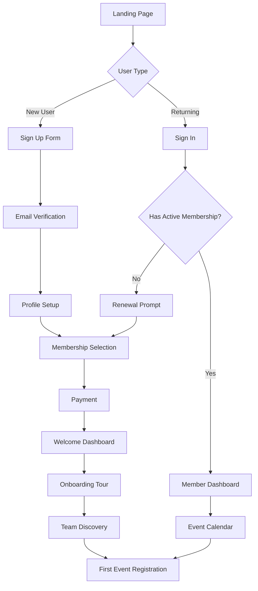
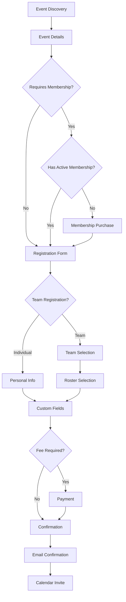
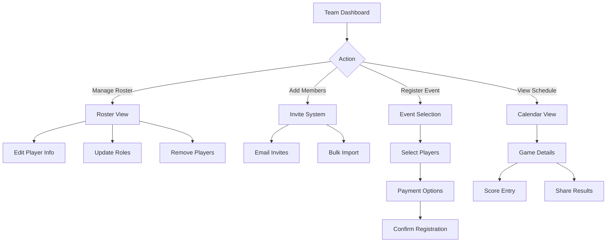

# User Journeys & Flows

## Core User Personas

### 1. New Player

**Goal**: Join the quadball community, find a team, participate in events
**Pain Points**: Unfamiliar with sport, doesn't know local teams, registration complexity

### 2. Experienced Player

**Goal**: Renew membership, register for tournaments, manage team
**Pain Points**: Time constraints, multiple registrations, payment management

### 3. Team Captain/Coach

**Goal**: Manage roster, register team for events, communicate with players
**Pain Points**: Administrative overhead, tracking payments, coordinating schedules

### 4. Event Coordinator

**Goal**: Create events, manage registrations, track attendance
**Pain Points**: Manual processes, payment tracking, communication at scale

### 5. League Administrator

**Goal**: Oversee all operations, generate reports, manage finances
**Pain Points**: Data silos, manual reporting, compliance tracking

## Primary User Journeys

### Journey 1: New Member Registration & First Event

```
Discovery → Registration → Profile → Payment → Team Search → Event Registration → Participation

┌─────────────┐    ┌─────────────┐    ┌─────────────┐    ┌─────────────┐
│   Landing   │───▶│   Sign Up   │───▶│   Profile   │───▶│   Payment   │
│             │    │             │    │   Setup     │    │             │
│ - Learn     │    │ - Email     │    │ - Details   │    │ - Membership│
│ - CTA       │    │ - Password  │    │ - Emergency │    │ - Checkout  │
│ - Social    │    │ - Terms     │    │ - Privacy   │    │ - Confirm   │
└─────────────┘    └─────────────┘    └─────────────┘    └─────────────┘
                                                                │
┌─────────────┐    ┌─────────────┐    ┌─────────────┐         │
│Participate  │◀───│  Register   │◀───│ Find Team   │◀────────┘
│             │    │  for Event  │    │             │
│ - Show up   │    │ - Select    │    │ - Browse    │
│ - Play      │    │ - Pay fees  │    │ - Contact   │
│ - Connect   │    │ - Confirm   │    │ - Join      │
└─────────────┘    └─────────────┘    └─────────────┘
```

**Key Touchpoints**:

1. **Discovery** (Marketing site, social media, word of mouth)
2. **Registration** (Simple form, OAuth options)
3. **Profile Completion** (Required fields, optional demographics)
4. **Membership Purchase** (Clear pricing, payment options)
5. **Team Discovery** (Location-based, skill level)
6. **Event Registration** (Calendar view, easy selection)
7. **Confirmation** (Email, calendar invite, reminders)

**Success Metrics**:

- Registration completion rate > 80%
- Profile completion rate > 90%
- First event attendance > 70%
- Member retention after 3 months > 60%

### Journey 2: Returning Member Renewal

```
Login → Dashboard → Renewal Notice → Payment → Updated Access

┌─────────────┐    ┌─────────────┐    ┌─────────────┐
│   Login     │───▶│  Dashboard  │───▶│   Renew     │
│             │    │             │    │             │
│ - Remember  │    │ - Status    │    │ - Auto-fill │
│ - Quick     │    │ - Expiry    │    │ - Discount  │
│ - OAuth     │    │ - Reminder  │    │ - Payment   │
└─────────────┘    └─────────────┘    └─────────────┘
```

**Optimization Focus**:

- Pre-filled forms with existing data
- Early bird discounts for renewals
- One-click renewal for returning users
- Clear value proposition for continued membership

### Journey 3: Team Captain Event Registration

```
Team Dashboard → Event Discovery → Bulk Registration → Payment Management → Roster Confirmation

┌─────────────┐    ┌─────────────┐    ┌─────────────┐    ┌─────────────┐
│    Team     │───▶│   Browse    │───▶│  Register   │───▶│   Manage    │
│  Dashboard  │    │   Events    │    │    Team     │    │  Payments   │
│             │    │             │    │             │    │             │
│ - Roster    │    │ - Filter    │    │ - Select    │    │ - Track     │
│ - Events    │    │ - Calendar  │    │ - Players   │    │ - Collect   │
│ - Messages  │    │ - Details   │    │ - Waivers   │    │ - Report    │
└─────────────┘    └─────────────┘    └─────────────┘    └─────────────┘
```

**Key Features**:

- Bulk registration workflows
- Payment splitting options
- Roster management tools
- Communication templates

### Journey 4: Event Creation (Coordinator)

```
Admin Access → Template Selection → Event Setup → Registration Config → Publish → Manage

┌─────────────┐    ┌─────────────┐    ┌─────────────┐    ┌─────────────┐
│   Admin     │───▶│  Template   │───▶│    Setup    │───▶│   Config    │
│  Dashboard  │    │  Selection  │    │   Details   │    │Registration │
│             │    │             │    │             │    │             │
│ - Overview  │    │ - Tournament│    │ - Date/Time │    │ - Fields    │
│ - Events    │    │ - League    │    │ - Location  │    │ - Pricing   │
│ - Users     │    │ - Custom    │    │ - Capacity  │    │ - Deadlines │
└─────────────┘    └─────────────┘    └─────────────┘    └─────────────┘
                                                                │
┌─────────────┐    ┌─────────────┐                           │
│   Manage    │◀───│   Publish   │◀──────────────────────────┘
│             │    │             │
│ - Registrns │    │ - Preview   │
│ - Payments  │    │ - Announce  │
│ - Reports   │    │ - Schedule  │
└─────────────┘    └─────────────┘
```

## Detailed Flow Diagrams

### User Registration Flow



### Event Registration Flow



### Team Management Flow



## Mobile-First Considerations

### Key Mobile Flows

1. **Quick Registration**: Social login, autofill, minimal steps
2. **Event Check-in**: QR code scanning, one-tap confirmation
3. **Team Communication**: Push notifications, in-app messaging
4. **Payment**: Mobile wallet integration, saved payment methods

### Responsive Breakpoints

- **Mobile**: 320px - 768px (Touch-first, vertical navigation)
- **Tablet**: 768px - 1024px (Hybrid, collapsible sidebar)
- **Desktop**: 1024px+ (Full feature set, keyboard shortcuts)

## Accessibility Considerations

### Screen Reader Support

- Semantic HTML structure
- ARIA labels for interactive elements
- Skip navigation links
- Descriptive link text

### Keyboard Navigation

- Tab order follows visual flow
- All interactive elements accessible
- Keyboard shortcuts for power users
- Focus indicators clearly visible

### Visual Accessibility

- WCAG AA contrast ratios
- Scalable fonts (minimum 16px)
- Color not sole indicator
- Reduced motion options

## Error Handling & Edge Cases

### Common Error Scenarios

1. **Payment Failures**: Clear error messages, alternative payment methods
2. **Registration Deadlines**: Graceful degradation, waitlist options
3. **Network Issues**: Offline support, retry mechanisms
4. **Invalid Data**: Inline validation, helpful error messages

### Edge Cases

1. **Event Capacity**: Real-time updates, waitlist management
2. **Membership Expiry**: Grace periods, renewal reminders
3. **Team Transfers**: Approval workflows, historical tracking
4. **Duplicate Accounts**: Merge detection, resolution flows

## Performance Optimization

### Critical Rendering Path

1. **Above-fold content** loads in < 1 second
2. **Interactive elements** ready in < 2 seconds
3. **Full page load** complete in < 3 seconds

### Progressive Loading

- Critical CSS inlined
- JavaScript loaded progressively
- Images lazy-loaded below fold
- Non-critical features loaded on interaction

### Caching Strategy

- Static assets cached for 1 year
- API responses cached appropriately
- User data cached in localStorage
- Offline-first for core features

## Conversion Optimization

### A/B Testing Opportunities

1. **Registration flow** (single page vs. multi-step)
2. **Pricing display** (monthly vs. annual emphasis)
3. **CTA buttons** (color, text, placement)
4. **Onboarding** (guided tour vs. self-discovery)

### Analytics Tracking

- Funnel conversion rates
- User engagement metrics
- Feature adoption rates
- Error occurrence patterns

### Success Metrics by Journey

1. **Registration**: Completion rate, time to complete
2. **Membership**: Purchase rate, renewal rate
3. **Events**: Registration rate, attendance rate
4. **Teams**: Formation rate, retention rate
