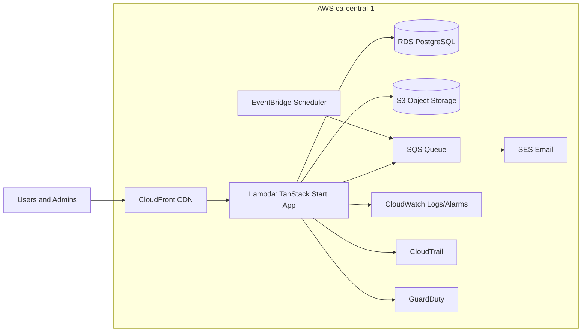
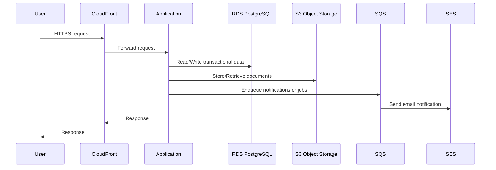
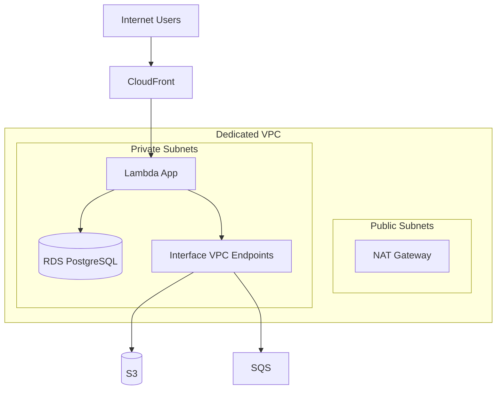

# SIN Reference Architecture

## Document Control

| Item     | Value                       |
| -------- | --------------------------- |
| Document | Reference Architecture      |
| Audience | viaSport BC Evaluation Team |
| Version  | 1.0                         |
| Scope    | Production SIN platform     |

## 1.0 Purpose and Scope

This document describes the proposed production architecture for the viaSport
Strength in Numbers (SIN) platform. The response follows the SIN RFP emphasis
on Canadian data residency, security, and auditability, and is intended to be
used as a reference for technical evaluation.

## 2.0 Architecture Summary

The SIN platform is deployed as a cloud-native, modular system in AWS
ca-central-1. The architecture separates the web edge, application tier, data
stores, and operational services. It is designed for secure multi-tenant
operation, compliance logging, and large-scale data ingestion.

Key attributes:

- Single-region deployment in Canada (ca-central-1)
- Serverless application tier with autoscaling
- Managed Postgres with Multi-AZ and PITR
- Object storage for documents and imports
- Event-driven processing for notifications and batch imports
- Centralized logging, audit, and security monitoring

## 2.1 Tenant Distribution Layer

The application uses a single codebase with tenant-aware configuration to
support both QC and viaSport distribution paths. Tenant selection is resolved
from `TENANT_KEY`/`VITE_TENANT_KEY` (hard-fail on mismatch), and feature flags
control routes, navigation, and server-side access to prevent cross-tenant data
exposure even if URLs are guessed. Branding and organization hierarchy rules
are also derived from the active tenant.

Canonical stages enforce deterministic tenant selection:
`qc-dev`, `sin-dev`, `qc-perf`, `sin-perf`, `qc-prod`, `sin-prod`.
The prefix selects tenant (`sin` maps to `viasport`), and the suffix selects the
environment class (`dev` | `perf` | `prod`).

## 3.0 Logical Architecture Diagram

## 4.0 Data Flow Diagram

## 5.0 Network Diagram

## 6.0 Component Descriptions

| Component               | Purpose               | Residency                 | Notes                    |
| ----------------------- | --------------------- | ------------------------- | ------------------------ |
| CloudFront              | CDN for static assets | Global edge, origin in CA | Cache static assets only |
| Lambda (TanStack Start) | Web app and API       | ca-central-1              | Autoscaling, stateless   |
| RDS PostgreSQL          | Primary data store    | ca-central-1              | Multi-AZ, PITR enabled   |
| S3                      | Documents and imports | ca-central-1              | SSE-KMS, versioning      |
| SQS                     | Queue for async tasks | ca-central-1              | Notifications, imports   |
| EventBridge Scheduler   | Time-based jobs       | ca-central-1              | Reminders, audits        |
| SES                     | Transactional email   | ca-central-1              | PII-minimized content    |
| CloudWatch              | Logs and metrics      | ca-central-1              | Centralized monitoring   |
| CloudTrail              | Audit for AWS actions | ca-central-1              | Immutable logs           |
| GuardDuty               | Threat detection      | ca-central-1              | Security alerts          |

## 7.0 Operational and Compliance Notes

- All production data is stored and processed in ca-central-1.
- PII responses are served with Cache-Control: no-store.
- Secrets are stored in AWS Secrets Manager and injected at deploy time.
- Multi-AZ and PITR are enabled for production RDS.
- Audit logs are append-only with tamper-evident hashing.
- Background processing uses queues and workers to handle large imports.

## 8.0 References

- `docs/sin-rfp/sst-migration-plan.md`
- `docs/sin-rfp/hosting-compliance.md`
- `docs/sin-rfp/SIN-REQUIREMENTS.md`
